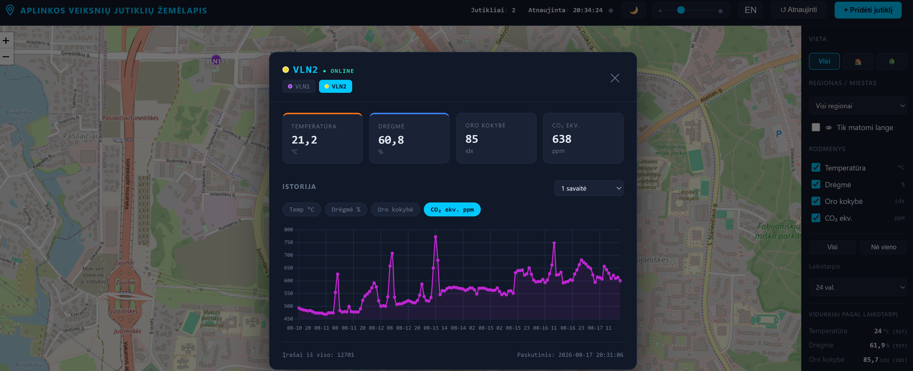

# IoT Sensorių Žemėlapis — Aplinkos Duomenų Stebėsenos Sistema

Realaus laiko žemėlapiu pagrįsta IoT jutiklių agregavimo platforma aplinkos rodikliams stebėti. Jutikliai (ESP32 / ESP8266) siunčia matavimus į REST API, o žemėlapis rodo jų vietą ir naujausius duomenis. Sukurta veikti įprastame PHP + MySQL serveryje (Hostinger, XAMPP).



> 🇬🇧 **English version:** žr. [`README_EN.md`](README_EN.md).

### 📚 Susijusi dokumentacija

| Dokumentas | Turinys |
|-----------|---------|
| [`README_EN.md`](README_EN.md) | 🇬🇧 This document in English |
| [`ARCHITEKTO-ATASKAITA.md`](ARCHITEKTO-ATASKAITA.md) | Architektūros ataskaita — sistemos struktūra, komponentai, sprendimų pagrindimas ([EN](ARCHITEKTO-ATASKAITAENG.md)) |
| [`DEVELOPERIO-VERTINIMAS.md`](DEVELOPERIO-VERTINIMAS.md) | Programuotojo vertinimas — kodo apžvalga, realizacijos sprendimai ([EN](DEVELOPERIO-VERTINIMASENG.md)) |
| [`PRODUCTION-VERTINIMAS.md`](PRODUCTION-VERTINIMAS.md) | Produkcijos pasirengimo vertinimas — saugumas, diegimas, priežiūra ([EN](PRODUCTION-VERTINIMASENG.md)) |
| [`tests.md`](tests.md) | Testavimo dokumentacija — testų rinkiniai, aprėptis, atsekamumas ([EN](testsENG.md)) |

Politikos puslapiai (HTML, dvikalbiai): privatumo — [`privacy.php`](privacy.php), slapukų — [`cookies.php`](cookies.php).

---

## Turinys

1. [Aktualumas — aplinkos duomenų stebėsena](#1-aktualumas)
2. [Funkciniai reikalavimai (FR)](#2-funkciniai-reikalavimai-fr)
3. [Nefunkciniai reikalavimai (NFR)](#3-nefunkciniai-reikalavimai-nfr)
4. [Įrankių ir technologijų stekas](#4-įrankių-ir-technologijų-stekas)
5. [Alternatyvų vertinimas](#5-alternatyvų-vertinimas)
6. [Duomenų bazės struktūra ir modelis](#6-duomenų-bazės-struktūra-ir-modelis)
7. [ER diagrama](#7-er-diagrama)
8. [Realizacijos komentarai](#8-realizacijos-komentarai)
9. [ESP32 / ESP8266 firmware pavyzdžiai](#9-esp32--esp8266-firmware-pavyzdžiai)
10. [API aprašas su pavyzdžiais](#10-api-aprašas-su-pavyzdžiais)
11. [Administratoriaus vadovas](#11-administratoriaus-vadovas)
12. [Naudotojo vadovas](#12-naudotojo-vadovas)
13. [Diegimas](#13-diegimas)
14. [Licencija ir šaltiniai](#14-licencija-ir-šaltiniai)

---

## 1. Aktualumas

**Aplinkos duomenų stebėsena.** Oro kokybė, temperatūra, drėgmė, CO₂ koncentracija, kietosios dalelės (PM1/PM2.5/PM10), žiedadulkės ir foninė radiacija tiesiogiai veikia žmonių sveikatą ir gerovę. Tradicinės valstybinės matavimo stotys yra brangios ir retos — tankiai apgyvendintose vietovėse jų gali būti vos kelios visam miestui. Dėl to susidaro dideli „akli" plotai, kuriuose realios sąlygos lieka nežinomos.

**Sprendimo idėja.** Pigūs IoT jutikliai (ESP32 / ESP8266 su skaitmeniniais davikliais) leidžia kurti tankų piliečių valdomą matavimo tinklą. Kiekvienas jutiklis kainuoja kelis eurus, montuojamas patalpoje arba lauke ir kas 5 minutes siunčia matavimus. Ši sistema juos surenka, susieja su geografine vieta ir parodo interaktyviame žemėlapyje, kad bet kas galėtų realiu laiku matyti aplinkos būklę savo rajone.

**Pritaikymo sritys:**
- **Švietimas (STEAM)** — mokyklos ir universitetai gali statyti jutiklius, mokytis IoT, duomenų rinkimo ir vizualizacijos.
- **Piliečių mokslas** — bendruomenės stebi oro taršą, mikroklimatą, alergenų lygį.
- **Vietos savivalda** — papildomi duomenys prie oficialių stočių, „karštųjų taškų" nustatymas.
- **Tyrimai** — tankūs erdviniai-laiko duomenys mikroklimato, taršos sklaidos analizei.

**Tikslinė apimtis.** Sistema suprojektuota stebėti iki **49 800 jutiklių** viename įprastame serveryje, kiekvienam siunčiant ≤1 matavimą per 5 minutes (~166 įrašymai per sekundę piko metu). Pagrindinis miestas — Vilnius (prefiksas VLN), bet žemėlapį galima centruoti į bet kurią iš **197 pasaulio sostinių**.

---

## 2. Funkciniai reikalavimai (FR)

Funkciniai reikalavimai apibrėžia, **ką** sistema daro. Kiekvienas turi unikalų ID, kad būtų galima atsekti iki testų (žr. `tests.md`).

| ID | Reikalavimas | Aprašymas |
|----|-------------|-----------|
| **FR-1** | Jutiklio registracija | Naudotojas gali užregistruoti naują jutiklį pateikdamas koordinates (lat/lng) ir tipą (patalpos/lauko). Sistema priskiria miesto prefiksą ir eilės numerį (pvz. VLN1). |
| **FR-2** | MAC priskyrimas pirmu siuntimu | Jutiklio MAC adresas užfiksuojamas per pirmą matavimo siuntimą, ne registracijos metu. Tai leidžia paruošti firmware be koordinačių. |
| **FR-3** | Matavimų priėmimas | API priima matavimus (temperatūra, drėgmė, CO₂, PM1, PM2.5, PM10, žiedadulkės, radiacija, bei dujos/oro kokybė: alcohol, methane, propane, butane, lpg, hydrogen, co, smoke, ammonia, nox, benzene, air_quality, co2_equiv — iš viso 21 metrika) per HTTP GET/POST. Pasirinktinai priimama įrenginio UTC laiko žyma `recorded_at` (validuojama). |
| **FR-4** | Tapatybė pagal lat+lng+MAC | Jutiklis vienareikšmiškai identifikuojamas trijule (lat, lng, MAC). Tas pats MAC skirtingose koordinatėse — atskiri jutikliai. |
| **FR-5** | Žemėlapio rodymas | Viešas puslapis rodo visus patvirtintus jutiklius žemėlapyje su žymekliais. Žymekliai **grupuojami pagal mastelį** (zoom-aware klasteriai — Web-Mercator pikselių tinklelis): nutolinus artimi žymekliai jungiami, priartinus išsiskaido. Pasirinktinai — **„Tik matomi lange"** filtras (rodomi tik dabartiniame žemėlapio lange esantys jutikliai). Žemėlapio tiekėjas pasirenkamas **eksplicitiškai** admin sąsajoje (`MAP_TILE_PROVIDER`): **Google Maps** (reikia API rakto), **OpenTopoMap**, **CARTO**, **OpenStreetMap** arba **Yandex** (per Leaflet, be rakto). Visi naudoja tą pačią WGS84 koordinačių sistemą. Slapukų ir privatumo tekstas keičiasi automatiškai pagal pasirinkimą. |
| **FR-6** | Naujausio matavimo rodymas | Kiekvieno jutiklio žymeklis rodo paskutinį matavimą ir „online/offline" būseną (pagal `last_seen`). Popup'e rodomas ir **„Ping"** = serverio įrašo laikas − jutiklio siuntimo laikas (`received_at − recorded_at`). |
| **FR-7** | Istorijos grafikas | Naudotojas gali peržiūrėti pasirinkto jutiklio istoriją grafiku (Chart.js) su **laikotarpio parinkikliu** (1 d. / 1 sav. / 2 sav. / 1 mėn. / 3 mėn. / 6 mėn. / 12 mėn.); ilgi laikotarpiai agreguojami serveryje (AVG į laiko kibirus). |
| **FR-8** | Filtravimas | Žemėlapį galima filtruoti pagal jutiklio tipą (patalpos/lauko), rodomą metriką ir **regioną/miestą**. Metrikų filtras **dinaminis** — rodomi tik tie rodikliai, kurie turi duomenų DB. Filtras paveikia ir žemėlapį, ir suvidurkintus duomenis. |
| **FR-9** | Realaus laiko atnaujinimas | Žemėlapis atsinaujina automatiškai — numatytuoju režimu 30 s polling, pasirinktinai SSE (Server-Sent Events) realiu laiku. |
| **FR-10** | Administravimo skydas | Apsaugotas slaptažodžiu skydas DB konfigūracijai, schemos diegimui, jutiklių valdymui ir metrikoms. |
| **FR-11** | Jutiklio trynimas / valymas | Administratorius gali: (a) ištrinti vieną jutiklį arba išvalyti jo matavimus; (b) **pažymėti kelis jutiklius (checkbox) ir masiškai ištrinti juos arba jų duomenis**; (c) **išvalyti ar ištrinti visą regioną** (city_prefix). Visi veiksmai reikalauja slaptažodžio; trynimas kaskadinis. |
| **FR-12** | Duomenų eksportas | Matavimus galima eksportuoti CSV arba JSON formatu. |
| **FR-13** | Sveikatos patikra | `health` endpoint'as grąžina DB ir disko būseną stebėjimui. |
| **FR-14** | Metrikų panelė | Administratorius mato jutiklių skaičių, offline procentą, įrašų talpą, įrašus per dieną. |
| **FR-15** | HMAC autentifikacija | Jutikliai gali pasirašyti matavimus HMAC-SHA256 parašu. Bendrasis raktas (`secret`) priskiriamas jutikliui **administratoriaus sąsajoje** (mygtukas „🔐 HMAC" jutiklio eilutėje) ir įrašomas į DB; tas pats raktas nurodomas firmware. Kai raktas nustatytas, nepasirašyti ar neteisingai pasirašyti matavimai atmetami (HTTP 401), apsaugant nuo suklastotų duomenų. Raktas niekada negrąžinamas per API. |
| **FR-16** | Šalies pasirinkimas | Administratorius gali pasirinkti šalį iš 197; žemėlapis automatiškai centruojamas į jos sostinę. Šalių ir sostinių pavadinimai rodomi dvikalbiai (LT / EN). |
| **FR-17** | GDPR / BDAR puslapiai | Sistema turi dvikalbius privatumo ir slapukų puslapius su sutikimo mechanizmu. Politika automatiškai keičiasi pagal žemėlapio tiekėją (Google Maps arba OpenStreetMap) — aprašo, kam ir kokie duomenys siunčiami. |
| **FR-18** | Audito žurnalas | Jautrūs veiksmai (trynimas, valymas, rakto priskyrimas, prisijungimo blokai) registruojami audito žurnale su IP ir laiku. |
| **FR-19** | Dviejų pakopų prisijungimas | Administratoriaus prisijungimas vyksta dviem pakopomis: 1) naudotojo vardas (el. paštas); 2) el. paštas + slaptažodis. El. paštas saugomas tik kaip hash DB (žr. NFR-5). Pirmo paleidimo metu nustatomi ir slaptažodis, ir el. paštas. |
| **FR-20** | Saugumo žurnalo skydas | Administravimo skyde rodomas saugumo žurnalas: nesėkmingi prisijungimai, blokuoti IP ir veiksmai. Administratorius gali blokuoti / atblokuoti IP adresą ir trinti žurnalo įrašus (žr. NFR-6). |
| **FR-21** | Vidurkiai pagal laikotarpį | Pradiniame puslapyje rodomi matavimų vidurkiai (visoms metrikoms), skaičiuojami serveryje iš `readings` istorijos pagal pasirinktą laikotarpį: 4/6/12/24 val., 7/30/90/180/365 d. arba „visas laikas" (nuo pirmo jutiklio paleidimo). Skaičiavimas derinamas su esamais filtrais — regionu (miestu) ir patalpos/lauko. |
| **FR-22** | Įrenginio laikas ir „ping" | Jutiklis gauna laiką iš NTP pagal 0 meridianą (UTC) ir siunčia jį kaip `recorded_at`. Serveris atskirai fiksuoja įrašo laiką (`received_at`). Žemėlapio popup'e rodomas **Ping = `received_at − recorded_at`** (visada, kai yra įrašas). |
| **FR-23** | Schemos ↔ DB suderinimas | Diegiant DB, reali DB struktūra palyginama su `schema.sql`. Jei atitinka — schema ištrinama; jei schema platesnė/naujesnė — DB **pirma praplečiama** trūkstamais elementais (`ADD COLUMN IF NOT EXISTS`), patikrinama atitiktis, **tik tada** schema ištrinama. Jei atitikti nepavyksta — `schema.sql` išlaikomas. |
| **FR-24** | Atskirti statiniai failai | CSS iškelta į `assets/styles.css` (kraunama per PHP `include`), JS — į `assets/app.js` (importuojama per `<script src>`). PHP injekcijos lieka tik mažame `window.CFG` bloke. |

---

### Atsekamumas

Visi FR atsekami iki testų `tests.md` (FR-1…FR-24, NFR-1…NFR-12). Pilnas rinkinys: **441 vidinis testas · 24 PHPUnit · 19 frontend** (0 klaidų).

---

## 3. Nefunkciniai reikalavimai (NFR)

Nefunkciniai reikalavimai apibrėžia, **kaip gerai** sistema veikia (kokybės atributai).

| ID | Kategorija | Reikalavimas |
|----|-----------|-------------|
| **NFR-1** | Mastelis | Sistema turi aptarnauti iki 49 800 jutiklių, ~166 įrašymai/sek piko metu, viename serveryje. |
| **NFR-2** | Našumas | `map_data` ir `reading` užklausos turi grįžti per <100 ms tipiniam apkrovimui; viewport užklausa riboja grąžinamų jutiklių kiekį. |
| **NFR-3** | Saugumas — SQL | Visi DB kreipimaisi per PDO prepared statements; jokios tiesioginės įvesties interpoliacijos. |
| **NFR-4** | Saugumas — XSS | Visa naudotojo įvestis filtruojama (escapeHtml) prieš rodymą; CSP antraštės ribojamos. |
| **NFR-5** | Saugumas — autentifikacija | **Dviejų pakopų prisijungimas**: naudotojo vardas = el. paštas (saugomas tik kaip hash DB lentelėje `admin_credentials`), slaptažodis bcrypt (cost 12) atskirame settings faile. 1 pakopa — tik el. paštas; 2 pakopa — el. paštas + slaptažodis. Stiprumo politika (≥8 simb., didžioji, skaičius, spec). |
| **NFR-6** | Saugumas — brute-force | **1 pakopa:** 3 neteisingi el. paštai → 60 min IP blokas (be klaidos pranešimo — apsauga nuo el. paštų atspėjimo). **2 pakopa:** 2 neteisingi prisijungimo duomenys → 24 val. blokas + įrašas į saugumo žurnalą + prašymas pakeisti slaptažodį. Admin skyde — saugumo žurnalas su IP blokavimu/atblokavimu ir įrašų trynimu. |
| **NFR-7** | Saugumas — rate limiting | `reading` ribojamas iki 2 užklausų per 5 min vienam MAC (apsauga nuo užtvindymo). |
| **NFR-8** | Suderinamumas | Veikia PHP 8.1+ įprastame shared hosting'e (Hostinger, XAMPP) be Composer/Node.js. Testai nenaudoja shell funkcijų (gali būti išjungtos). |
| **NFR-9** | Perkeliamumas | Zero-build: jokios kompiliacijos; įkėlimas per FTP, diegimas per naršyklę. |
| **NFR-10** | Patikimumas | Klaidos nerodomos naršyklėje (`display_errors=0`), rašomos į žurnalą; automatinis DB backup (cron). |
| **NFR-11** | Privatumas / GDPR | Slapukų sutikimas, dvikalbiai privatumo puslapiai, duomenų saugojimo terminas (DATA_RETENTION_DAYS). |
| **NFR-12** | Prieinamumas | Žemėlapis veikia mobiliuosiuose ir staliniuose įrenginiuose; dvikalbė sąsaja (LT/EN). |
| **NFR-13** | Priežiūra | Modulinė struktūra (`includes/`); ~466 automatinių testų (PHP vienetiniai ir integraciniai, PHPUnit-stiliaus, frontend), paleidžiamų vienu skriptu **be išorinių priklausomybių** (be Composer, be CI paslaugų) — tinka ir lokaliam, ir shared hosting paleidimui. |
| **NFR-14** | Atsparumas duomenims | Schema diegiama atspariai (apostrofus gerbiantis SQL skaidymas); konfigūracija per var_export (injekcijai atspari). |

---

## 4. Įrankių ir technologijų stekas

| Sluoksnis | Technologija | Versija | Šaltinis / dokumentacija |
|-----------|-------------|---------|--------------------------|
| Serverio kalba | PHP | 8.1+ | https://www.php.net/docs.php |
| Duomenų bazė | MySQL / MariaDB | 10.4+ | https://mariadb.org/documentation/ |
| DB kreipiniai | PDO (prepared statements) | — | https://www.php.net/manual/en/book.pdo.php |
| Žemėlapis (su raktu) | Google Maps JavaScript API | v3 | https://developers.google.com/maps/documentation/javascript |
| Žemėlapis (be rakto) | Leaflet (lokalus) + OpenTopoMap/CARTO/OSM/Yandex plytelės | 1.9.4 | https://leafletjs.com/ · https://carto.com/basemaps/ · https://www.openstreetmap.org/ |
| Geokodavimas | Google Geocoding API | — | https://developers.google.com/maps/documentation/geocoding |
| Grafikai | Chart.js | 4.x | https://www.chartjs.org/docs/latest/ |
| Klientinė logika | Vanilla JavaScript (ES6+) | — | https://developer.mozilla.org/en-US/docs/Web/JavaScript |
| Realaus laiko | Server-Sent Events (EventSource) | — | https://developer.mozilla.org/en-US/docs/Web/API/Server-sent_events |
| Jutiklių platforma | ESP32 / ESP8266 | — | https://docs.espressif.com/projects/esp-idf/ |
| Firmware | Arduino framework | — | https://docs.arduino.cc/ |
| HMAC (ESP8266) | BearSSL | — | https://www.bearssl.org/ |
| HMAC (ESP32) | mbedTLS | — | https://www.trustedfirmware.org/projects/mbed-tls/ |
| Slaptažodžiai | bcrypt (password_hash) | — | https://www.php.net/manual/en/function.password-hash.php |
| Testai (PHP) | Savas minimalus karkasas + PHPUnit-stiliaus shim | — | (be Composer; žr. `tests/`) |
| Testai (frontend) | Node.js test runner | 18+ | https://nodejs.org/api/test.html |
| E2E testai | Playwright | — | https://playwright.dev/ |
| Apkrovos testai | k6 | — | https://k6.io/docs/ |
| Testų paleidimas | Vienas PHP/Node skriptas (`tests/run.php`) | — | (be CI priklausomybių; veikia lokaliai ir shared hosting'e) |

**Architektūros principai:**
- **Zero-build** — jokio Webpack/Vite/npm. Visi failai veikia paleidus juos viešame serveryje tiesiogiai be papildomų paketų.
- **Be priklausomybių serveryje** — nereikia Composer, PHPUnit keičiamas savu shim.
- **Progresyvus** — žemėlapis veikia su polling; taip pat realizuotas SSE palaikymas.

---

## 5. Alternatyvų vertinimas

Prieš kuriant savą sprendimą, įvertintos esamos platformos. Visos konceptualiai panašios, bet netiko dėl konkrečių priežasčių.

| Sprendimas | Privalumai | Kodėl netiko šiam projektui |
|-----------|-----------|----------------------------|
| **[Sensor.Community](https://sensor.community/)** (buv. luftdaten.info) | Didelis pasaulinis oro kokybės tinklas, atvira platforma | Centralizuota globali infrastruktūra; sunku savarankiškai talpinti edukacijai; fiksuotas duomenų modelis |
| **[OpenSenseMap](https://opensensemap.org/)** | Atvirojo kodo, edukacijai pritaikyta, REST API | Node.js + MongoDB stekas — netinka PHP shared hosting'ui; reikalauja serverio administravimo |
| **[ThingsBoard](https://thingsboard.io/)** | Galinga IoT platforma, taisyklės, dashboard'ai | Java + sudėtinga infrastruktūra (Cassandra/PostgreSQL); per sunkus mokomajam projektui shared hosting'e |
| **[Grafana](https://grafana.com/) + [InfluxDB](https://www.influxdata.com/)** | Profesionalūs laiko eilučių dashboard'ai | Reikalauja dedikuoto serverio/VPS; ne žemėlapio-centriškas; sudėtinga sąranka |
| **[Home Assistant](https://www.home-assistant.io/)** | Plati IoT integracija | Skirta namų automatizacijai, ne viešam miestiniam žemėlapiui |
| **[Leaflet](https://leafletjs.com/) + [OpenStreetMap](https://www.openstreetmap.org/)** | Atviras, nemokamas, be API rakto | **Įgyvendinta kaip alternatyva** — kai nėra Google Maps rakto, automatiškai naudojamas OSM per Leaflet (žr. 8.10). Google Maps lieka pasirinktimi dėl integruoto geokodavimo |

**Sprendimo pasirinkimo pagrindimas.** Sukurtas **savas PHP + MySQL sprendimas**, nes:
1. **Shared hosting suderinamumas** — veikia bet kuriame €3/mėn PHP hostinge be VPS.
2. **Zero-build** — studentai gali įkelti per FTP ir paleisti per naršyklę.
3. **Edukacinė vertė** — visas kodas skaidrus, be juodų dėžių.
4. **Pilna kontrolė** — duomenų modelis pritaikytas tiksliai aplinkos metrikoms.

---

## 6. Duomenų bazės struktūra ir modelis

Duomenų bazę sudaro **5 lentelės**. Modelis suprojektuotas taip, kad jutiklio tapatybė būtų `lat + lng + MAC`, o matavimai būtų atskiri įrašai su kaskadiniu trynimu.

### 6.1 Lentelė `sensors` — jutikliai

| Stulpelis | Tipas | Aprašymas |
|-----------|-------|-----------|
| `id` | INT AUTO_INCREMENT PK | Pirminis raktas |
| `lat` | DECIMAL(10,7) | Platuma (7 skaitmenys ≈ 1 cm tikslumas) |
| `lng` | DECIMAL(10,7) | Ilguma (7 skaitmenys ≈ 1 cm tikslumas) |
| `mac` | VARCHAR(17) NULL | WiFi MAC (AA:BB:CC:DD:EE:FF); NULL kol laukia pirmo siuntimo |
| `is_outdoor` | TINYINT(1) | 0 = patalpos, 1 = lauko |
| `secret` | VARCHAR(64) NULL | Pasirinktinis HMAC shared-secret |
| `city_prefix` | VARCHAR(10) | Miesto kodas (pvz. VLN) |
| `confirmed` | TINYINT(1) | 0 = laukia patvirtinimo, 1 = patvirtintas |
| `registered_at` | DATETIME | Registracijos laikas |
| `last_seen` | DATETIME | Paskutinio matavimo laikas (online/offline) |

**Indeksai:** `UNIQUE uq_coords_mac(lat,lng,mac)`, `idx_coords(lat,lng)`, `idx_city_id(city_prefix,id)`, `idx_last_seen`, `idx_confirmed`.

### 6.2 Lentelė `readings` — matavimai

| Stulpelis | Tipas | Vienetai |
|-----------|-------|----------|
| `id` | BIGINT AUTO_INCREMENT PK | — |
| `sensor_id` | INT FK→sensors | — |
| `recorded_at` | DATETIME | jutiklio matavimo/siuntimo laikas (UTC; jei įrenginys nesiunčia — serverio laikas) |
| `received_at` | DATETIME | serverio įrašo laikas (DEFAULT CURRENT_TIMESTAMP) — naudojamas „ping" skaičiavimui |
| `temperature` | DECIMAL(6,2) | °C |
| `humidity` | DECIMAL(5,2) | % |
| `co2` | DECIMAL(8,2) | ppm (tikras CO₂, NDIR) |
| `pm1` | DECIMAL(8,2) | µg/m³ |
| `pm2_5` | DECIMAL(8,2) | µg/m³ |
| `pm10` | DECIMAL(8,2) | µg/m³ |
| `grains` | DECIMAL(8,2) | grains/m³ |
| `radiation` | DECIMAL(8,4) | µSv/h |
| `alcohol`, `methane`, `propane`, `butane`, `lpg`, `hydrogen`, `co`, `smoke`, `ammonia`, `nox`, `benzene` | DECIMAL(8,2) | ppm (dujos — MQ-2/4/6/8/135 šeima) |
| `air_quality` | DECIMAL(8,2) | oro kokybės indeksas (MQ-135) |
| `co2_equiv` | DECIMAL(8,2) | CO₂ ekvivalentas, ppm (MQ-135 — **ne** tikras CO₂) |

**Indeksai:** `idx_sensor_time(sensor_id,recorded_at)`, `idx_recorded_at`. **FK:** `ON DELETE CASCADE` (ištrynus jutiklį, matavimai pašalinami automatiškai). Visi metrikų stulpeliai NULL — jutiklis siunčia tik turimas metrikas. **„Ping"** = `received_at − recorded_at` (perdavimo vėlinimas), rodomas žemėlapio popup'e. **Migracija:** dujų stulpeliai ir `received_at` pridedami esamoms DB idempotentiškai (`ALTER TABLE … ADD COLUMN IF NOT EXISTS`).

### 6.3 Lentelė `rate_limits` — užklausų ribojimas

| Stulpelis | Tipas | Aprašymas |
|-----------|-------|-----------|
| `rl_key` | VARCHAR(120) PK | Raktas (pvz. MAC arba IP) |
| `window_start` | INT | Unix laikas, lango pradžia |
| `counter` | INT | Užklausų skaičius lange |

### 6.4 Lentelė `audit_log` — audito žurnalas

| Stulpelis | Tipas | Aprašymas |
|-----------|-------|-----------|
| `id` | BIGINT AUTO_INCREMENT PK | — |
| `occurred_at` | DATETIME | Įvykio laikas |
| `actor_ip` | VARCHAR(45) | IP (IPv4/IPv6) |
| `action` | VARCHAR(40) | Veiksmas (pvz. delete_sensor) |
| `target_id` | INT NULL | Paveiktas jutiklis |
| `details` | VARCHAR(255) | Papildoma informacija |

**Indeksas:** `idx_audit_time(occurred_at)`.

### 6.5 Lentelė `admin_credentials` — administratoriaus kredencialai

Vienos eilutės (`id = 1`) lentelė dviejų pakopų prisijungimui. Saugomas **tik el. pašto hash** (naudotojo vardas), be atviro teksto. Slaptažodžio hash lieka `includes/settings.php` faile.

| Stulpelis | Tipas | Paskirtis |
|-----------|-------|-----------|
| `id` | TINYINT (=1) | Vienintelė eilutė |
| `email_hash` | VARCHAR(255) | Administratoriaus el. pašto (naudotojo vardo) vienkryptis hash |
| `password_change_required` | TINYINT(1) | Vėliava: nustatoma po 24 val. bloko (2 pakopa) |
| `updated_at` | DATETIME | Paskutinio keitimo laikas |

---

## 7. ER diagrama

Esybių-ryšių (Entity-Relationship) diagrama. `sensors` ↔ `readings` yra vienas-su-daug ryšys su kaskadiniu trynimu. `rate_limits` ir `audit_log` yra nepriklausomos pagalbinės lentelės.

```
┌─────────────────────────────────┐
│            sensors              │
├─────────────────────────────────┤
│ PK  id            INT           │
│     lat           DECIMAL(10,7) │
│     lng           DECIMAL(10,7) │
│     mac           VARCHAR(17)   │◄──┐ UNIQUE(lat,lng,mac)
│     is_outdoor    TINYINT(1)    │   │
│     secret        VARCHAR(64)   │   │
│     city_prefix   VARCHAR(10)   │   │
│     confirmed     TINYINT(1)    │   │
│     registered_at DATETIME      │   │
│     last_seen     DATETIME      │   │
└────────────┬────────────────────┘   │
             │ 1                      │
             │                        │
             │ N     ON DELETE CASCADE│
             ▼                        │
┌─────────────────────────────────┐   │
│           readings              │   │
├─────────────────────────────────┤   │
│ PK  id            BIGINT        │   │
│ FK  sensor_id     INT ──────────┼───┘
│     recorded_at   DATETIME      │
│     temperature   DECIMAL(6,2)  │
│     humidity      DECIMAL(5,2)  │
│     co2           DECIMAL(8,2)  │
│     pm1           DECIMAL(8,2)  │
│     pm2_5         DECIMAL(8,2)  │
│     pm10          DECIMAL(8,2)  │
│     grains        DECIMAL(8,2)  │
│     radiation     DECIMAL(8,4)  │
└─────────────────────────────────┘

┌──────────────────────┐   ┌──────────────────────────┐
│     rate_limits      │   │        audit_log         │
├──────────────────────┤   ├──────────────────────────┤
│ PK rl_key VARCHAR    │   │ PK  id          BIGINT   │
│    window_start INT  │   │     occurred_at DATETIME │
│    counter      INT  │   │     actor_ip    VARCHAR  │
└──────────────────────┘   │     action      VARCHAR  │
                           │     target_id   INT      │
                           │     details     VARCHAR  │
                           └──────────────────────────┘
```

**Kardinalumas:** 1 jutiklis → N matavimų (1:N). Ištrynus jutiklį, visi jo matavimai pašalinami automatiškai (CASCADE). `rate_limits` ir `audit_log` neturi tiesioginio FK ryšio — jie siejami logiškai (per MAC/IP ir target_id).

---

## 8. Realizacijos komentarai

Šioje sekcijoje aprašyti svarbūs realizacijos sprendimai.

### 8.1 Jutiklio tapatybė ir MAC priskyrimas

Jutiklis identifikuojamas trijų kintamųjų pagalbą **(lat, lng, MAC)**. Registracijos metu pateikiamos tik koordinatės ir tipas — **MAC dar nežinomas**. MAC užfiksuojamas per pirmą matavimo siuntimą:
- **Tikslus sutapimas** (lat+lng+MAC jau yra) → pridedamas matavimas.
- **Laukiantis įrašas** (lat+lng su MAC=NULL) → priskiriamas MAC, jutiklis patvirtinamas (`confirmed=1`).
- **Nėra atitikmens** → 403 (jutiklis neregistruotas tose koordinatėse).

Tai leidžia paruošti firmware **be koordinačių** — jutiklis siunčia savo MAC automatiškai, o vieta nustatoma registracijos metu naršyklėje.

### 8.2 HMAC parašo formatas 

Serveris pasirašo **žalią (raw) GET reikšmę**, ne apdorotą float. Firmware siunčia `String(lat, 7)` = `"54.6872000"` (su užbaigiamais nuliais). Jei serveris pasirašytų PHP float `54.6872` (be nulių), parašai **niekada nesutaptų**. Todėl:

```
payload = rawLat + "|" + rawLng + "|" + mac
sig = HMAC-SHA256(payload, secret)   // mažosios hex raidės
```

Tvarka griežta: **lat|lng|mac**. Metrikos į parašą neįeina.

**Laiku susietas variantas (su `recorded_at`).** Kai įrenginys siunčia UTC laiko žymą, ji gali būti įtraukta į parašą — `payload = lat|lng|mac|ts` — taip parašas susiejamas su laiku (apsauga nuo pakartojimo). Laikas papildomai siunčiamas kaip `recorded_at` ir naudojamas matavimų koreliacijai (žr. 6.2 ir API skyrių).

**Rakto priskyrimas.** Bendrasis raktas (`secret`) priskiriamas jutikliui administravimo sąsajoje (`manage.php` → jutiklio eilutės mygtukas „🔐 HMAC"; reikia administratoriaus slaptažodžio). Įvestas raktas įrašomas į `sensors.secret` DB lauką, o tas pats raktas nurodomas firmware (`const char* SECRET`). Tipinė eiga: jutiklis užregistruojamas ir patvirtinamas pirmu matavimu → administratorius priskiria jam raktą → nuo to momento visi matavimai turi būti pasirašyti teisingu `sig`, kitaip atmetami (HTTP 401). Tuščias raktas išjungia HMAC tam jutikliui. Raktas niekada negrąžinamas per API (rodoma tik būsena „įjungta/išjungta").

### 8.3 SQL schemos diegimas

Schema diegiama **apostrofus gerbiančiu** SQL skaidytuvu (`splitSqlStatements`), o ne naiviu `explode(';')`. Naivus skaidymas sukapotų komandą ties kabliataškiu, esančiu `COMMENT '...'` viduje. Papildomai — komentaruose nėra `;`, todėl schema atspari net naiviam skaidymui.

### 8.4 SSE ir sesijos užraktas

SSE (Server-Sent Events) endpoint'as **iškart atlaisvina sesijos užraktą** (`session_write_close()`). PHP užrakina sesijos failą užklausos metu; jei SSE laikytų jį atvirą, **visos kitos to paties naudotojo užklausos blokuotųsi**. Be to, SSE yra **pasirinktinis** (numatytasis — saugus 30 s polling), nes shared hosting'e atviri ryšiai gali išnaudoti PHP procesus.

### 8.5 Bendras saugumo antraščių failas

`setSecurityHeaders()` apibrėžta **viename faile** (`includes/security.php`), kurį įtraukia ir `config.php`, ir `auth.php`. Anksčiau funkcija buvo dviejuose failuose ir keldavo „Cannot redeclare" klaidą, kai puslapis įkraudavo abu. Be to, admin sugeneruotas `config.php` taip pat įtraukia `security.php`, ne savo kopiją.

### 8.6 Testai be shell funkcijų

Testai **nenaudoja** `shell_exec`/`exec`/`passthru` — jos dažnai išjungtos shared hosting'e (ir Windows XAMPP'e php.exe gali būti ne PATH'e). Vietoj subprocesų naudojama statinė kodo analizė (`token_get_all`, `preg_match`), kuri veikia visur identiškai.

### 8.7 Slaptažodžio hash'o bendras šaltinis

Admin slaptažodžio hash saugomas `includes/settings.php` (asociatyvus masyvas su `admin_password_hash`). **Tiek admin login (`admin.php`), tiek API trynimo apsauga (`auth.php`) skaito hash'ą iš tos pačios vietos.** Anksčiau `auth.php` skaitė tik seną `admin_pass.php`, todėl teisingas slaptažodis būdavo atmetamas trinant duomenis. Dabar `adminPasswordHash()` pirma tikrina `settings.php`, tada — atgaliniam suderinamumui — seną `admin_pass.php`.

### 8.8 Masinis ir regiono trynimas

`manage.php` jutikliai grupuojami pagal regioną (city_prefix). Masiniam trynimui API priima ID sąrašą (`ids=1,2,3`) — saugiai išskaidomą su dedupe ir limitu 1000, naudojant `IN (?,?,...)` parametrizuotą užklausą. Regiono operacijos (`clear_region`/`delete_region`) naudoja `DELETE ... JOIN`/`WHERE city_prefix`, o regiono kodas validuojamas (`[A-Z0-9]{1,10}`). Visi masiniai/regiono veiksmai turi tą pačią apsaugą kaip pavieniai (sesija + slaptažodis + audit log).

### 8.9 Regiono filtras ir vidurkiai

`index.php` filtravimas centralizuotas `sensorMatchesFilter()` funkcijoje, kurią naudoja ir žemėlapio piešimas (`renderMarkers`), ir suvidurkintų duomenų skaičiavimas (`renderAverages`). Todėl regiono/miesto, vietos (patalpos/lauko) ir metrikų filtrai paveikia abu vienu metu — pasirinkus regioną, vidurkiai persiskaičiuoja tik tam regionui. Slaptažodžio įvedimas naudoja maskuotą modalą (ne `prompt()`).

### 8.10 Žemėlapio tiekėjai (Google / OSM / Yandex)

Žemėlapio tiekėjas pasirenkamas  admin sąsajoje (`MAP_TILE_PROVIDER`) — tai vienas tiesos šaltinis (`effectiveMapProvider()` funkcija `includes/security.php`):
- **Google Maps** (`google`) → reikia API rakto (laukas rodomas tik pasirinkus Google).
- **OpenTopoMap / CARTO / OpenStreetMap / Yandex / Custom** → per Leaflet, be rakto.

Admin sąsajoje Google rakto laukas rodomas **tik** pasirinkus Google; Custom URL laukas — tik pasirinkus Custom. **Slapukų ir privatumo puslapiai automatiškai pritaikomi** pagal pasirinktą tiekėją (pvz. pasirinkus Yandex rodoma Yandex privatumo informacija, ne Google).

**Leaflet talpinamas projekte** (`assets/leaflet/`, ne iš CDN), todėl biblioteka įsikrauna patikimai shared hosting'e be išorinių užklausų ir CSP problemų.

**Konfigūruojamas plytelių tiekėjas.** Pagal [OSM plytelių naudojimo politiką](https://operations.osmfoundation.org/policies/tiles/) (kuri rekomenduoja nehardkodinti URL ir leisti keisti tiekėją), plytelių tiekėjas pasirenkamas admin sąsajoje (`MAP_TILE_PROVIDER`):
- `google` — Google Maps (reikia API rakto; laukas rodomas tik pasirinkus)
- `opentopomap` (numatyta) — OpenTopoMap topografinis (OSM + SRTM); dažnai pasiekiamas, kai kiti serveriai blokuojami
- `carto_voyager` — CARTO spalvotas su gatvėmis
- `carto_light` — CARTO šviesus
- `osm` — OpenStreetMap standartinis (`tile.openstreetmap.org`)
- `yandex` — Yandex Maps (regioninis, naudoja EPSG:3395 projekciją; naudinga, kai vakarietiški serveriai blokuojami)
- `custom` — savas URL (`MAP_TILE_URL`)

Tai naudinga, nes skirtingi tinklai/regionai pasiekia skirtingus serverius. Jei plytelės nesimato, admin gali pakeisti tiekėją be kodo keitimo. Naktiniam režimui naudojamas CARTO dark. Visi tiekėjai naudoja OSM duomenis ir turi tinkamą atribuciją. Jei plytelės vis tiek nesikrauna (tinklo blokas), žemėlapio funkcionalumas — žymekliai, filtrai, vidurkiai — veikia, o klaida rodoma naršyklės konsolėje.

> **Svarbu — CSP vienas šaltinis.** Content-Security-Policy nustatoma **tik PHP pusėje** (`includes/security.php`). `.htaccess` jos NEnustato. Jei CSP būtų ir `.htaccess`, ir PHP, naršyklė taikytų **griežtesnę iš dviejų** (sankirtą), ir žemėlapio plytelės būtų blokuojamos puslapyje, net jei tinklas jas pasiekia (plytelė atsidaro tiesiogiai, bet puslapyje nesimato). Nedubliuokite CSP `.htaccess` faile.

#### 8.10.1 Plytelių tiekėjų apribojimai ir limitai

Plytelių serveriai yra išorinių organizacijų ir turi naudojimo apribojimus. Svarbu juos žinoti renkantis tiekėją:

| Tiekėjas | Limitas / apribojimas | Pastabos |
|----------|----------------------|----------|
| **OpenStreetMap** (`osm`) | Be fiksuoto skaitinio limito, bet „best-effort" be SLA; blokuoja bulk atsisiuntimą, scrape ir offline naudojimą | Skirtas nedideliam interaktyviam naudojimui. Reikalauja galiojančio `User-Agent` ir `Referer` (naršyklė tai siunčia automatiškai). Bulk/prefetch — draudžiama. Žr. [OSM tile policy](https://operations.osmfoundation.org/policies/tiles/) |
| **OpenTopoMap** (`opentopomap`) | Mažas savanorių projektas, riboti pajėgumai; nėra fiksuoto limito, bet prašoma neperkrauti | Topografinis stilius (OSM + SRTM aukščio duomenys). EPSG:3857. Atskiras domenas `tile.opentopomap.org` — dažnai pasiekiamas, kai kiti blokuojami. Maks. mastelis 17 |
| **CARTO** (`carto_voyager`, `carto_light`) | **75 000 žemėlapio peržiūrų per mėnesį** nemokamai | Komercinis naudojimas, privačios programos, asset-tracking ar SLA reikalauja komercinės licencijos (nuo ~6000 USD/m.). Cached užklausos (per CDN) į limitą neįskaitomos |
| **Google Maps** (su raktu) | Pay-as-you-go, apmokestinama už 1000 užklausų | Reikalauja API rakto ir įjungto atsiskaitymo. Turi dienos kvotą ir užklausų/min. limitą |
| **Yandex Maps** (`yandex`) | Be aiškaus nemokamo limito plytelėms, bet ToS rekomenduoja naudoti jų JS API su raktu | Naudoja EPSG:3395 projekciją (žemėlapis kuriamas su atitinkama CRS). Naudinga regione, kur vakarietiški serveriai blokuojami. Tiesioginis plytelių naudojimas gali keistis — produkcijai rekomenduojamas Yandex JS API su raktu (developer.tech.yandex.ru) |
| **Savas** (`custom`) | Priklauso nuo pasirinkto tiekėjo | Galima naudoti savo plytelių serverį arba kitą OSM-pagrįstą paslaugą |

**Rekomendacijos šiam projektui** (mokomasis/nekomercinis, nedidelis srautas):
- **CARTO** (numatyta) tinka — projektas nekomercinis ir 75 000 peržiūrų/mėn. su kaupu pakanka tipiniam mokyklos/universiteto naudojimui.
- Jei srautas augtų arba reikėtų komercinio naudojimo, reikia komercinės CARTO licencijos arba savo plytelių serverio.
- **Naršyklė kešuoja plyteles** (HTTP cache), todėl pakartotinės peržiūros neperkrauna serverio.
- Jei plytelės kritiškai svarbios ir reikia garantijų — talpinkite plyteles patys (žr. [switch2osm.org](https://switch2osm.org/)) arba naudokite komercinį tiekėją.

Esmė — **OSM ir Google naudoja tą pačią WGS84 (lat/lng) koordinačių sistemą**, todėl visa esama jutiklių, koordinačių grupavimo ir registracijos logika veikia be pakeitimų. Kad nereikėtų perrašyti žemėlapio kodo, sukurtas plonas **suderinamumo sluoksnis (shim)**, kuris emuliuoja naudojamą `google.maps` API poaibį (`Map`, `Marker` su `setIcon`/`setLabel`/`setMap`/`addListener`, `SymbolPath.CIRCLE`, `setOptions`) per Leaflet. Jutiklio žymekliai atvaizduojami kaip apvalūs SVG `divIcon` su etiketėmis, dienos/nakties režimas perjungia plyteles (OSM standartinės / CARTO dark). Registracija veikia per koordinates ir vietinį 197 sostinių sąrašą, todėl geokodavimo raktas nebūtinas.

---

## 9. ESP32 / ESP8266 firmware pavyzdžiai

Žemiau — pilni, veikiantys firmware pavyzdžiai jutikliams. Visi siunčia matavimus per HTTP(S) GET, ima **kelis matavimus cikle ir vidurkina** (patikimumui), gauna **laiką iš interneto (NTP) pagal 0 meridianą (UTC)** ir siunčia jį kaip `recorded_at` (matavimų koreliacijai / „ping" skaičiavimui). Pilni `.ino` failai — kataloge `firmware/`:

| Failas | Jutikliai | Ypatybės |
|--------|-----------|----------|
| `firmware/esp_dht22_minimal/` | DHT22 | **Minimalus** pavyzdys (ESP8266 **ir** ESP32): NTP UTC laikas, 5× vidurkinimas, `recorded_at` siuntimas. Be MQ/HMAC/EEPROM. |
| `firmware/esp8266_dht22_mq135/` | DHT22 + MQ-135 | Daugiadujis (MQUnifiedsensor): co2_equiv, alcohol, co, ammonia, benzene, air_quality; EEPROM R0; temp/drėgmės korekcija; 5× vidurkinimas. |
| `firmware/esp8266_dht22_mq135_hmac/` | DHT22 + MQ-135 | HMAC-SHA256 (BearSSL) + HTTPS; EEPROM RZero; NTP UTC + poslinkis pagal koordinates; `recorded_at`. |

### 9.0 Minimalus pavyzdys (DHT22 + NTP UTC laikas + vidurkinimas)

Paprasčiausias atvejis, tinkamas ir ESP8266, ir ESP32. Parodo tris esminius dalykus: NTP laiką pagal 0 meridianą (UTC), kelių matavimų vidurkinimą ir UTC laiko žymos siuntimą.

```cpp
#if defined(ESP32)
  #include <WiFi.h>
  #include <HTTPClient.h>
#else
  #include <ESP8266WiFi.h>
  #include <ESP8266HTTPClient.h>
  #include <WiFiClientSecure.h>
#endif
#include <DHT.h>
#include <time.h>

const int SAMPLES = 5;                              // matavimų vidurkis

void setupTime() {
  configTime(0, 0, "pool.ntp.org", "time.google.com"); // 0,0 → UTC (0 meridianas)
  time_t now = time(nullptr);
  unsigned long t0 = millis();
  while (now < 1000000000UL && millis() - t0 < 15000) { delay(250); now = time(nullptr); }
}

String utcIso() {                                   // ISO 8601 UTC → recorded_at
  time_t now = time(nullptr); struct tm g; gmtime_r(&now, &g);
  char b[25]; strftime(b, sizeof(b), "%Y-%m-%dT%H:%M:%SZ", &g); return String(b);
}

void loop() {
  float tSum = 0, hSum = 0; int n = 0;
  for (int i = 0; i < SAMPLES; i++) {               // kelių matavimų vidurkis
    float t = dht.readTemperature(), h = dht.readHumidity();
    if (!isnan(t) && !isnan(h)) { tSum += t; hSum += h; n++; }
    delay(200);
  }
  if (n) {
    String url = "/api/sensors.php?action=reading&lat=...&lng=...&mac=" + WiFi.macAddress()
               + "&temperature=" + String(tSum/n, 1)
               + "&humidity="    + String(hSum/n, 1)
               + "&recorded_at=" + utcIso();         // UTC laiko žyma
    // … HTTP(S) GET …
  }
  delay(60000);
}
```

> Pilnas failas su WiFi/HTTP(S) logika: `firmware/esp_dht22_minimal/esp_dht22_minimal.ino`.

Žemiau — OSM ir Google naudoja tą pačią WGS84 koordinačių sistemą, todėl visa žemėlapio logika veikia be pakeitimų abiem tiekėjams.

### 9.1 ESP8266 (su BearSSL HMAC)

```cpp
#include <ESP8266WiFi.h>
#include <ESP8266HTTPClient.h>
#include <bearssl/bearssl_hmac.h>

const char* SSID   = "jusu-wifi";
const char* WIFIPW = "slaptazodis";
const char* HOST   = "https://jusu-serveris.lt/iot/api/sensors.php";
const char* MY_LAT = 54.6872000;
const char* MY_LNG = 25.2797000;

// HMAC shared-secret — turi sutapti su jutiklio `secret` reikšme DB.
// Palikite tuščią (""), jei jutiklis neturi secret (parašas neprivalomas).
const char* SECRET = "mano-jutiklio-secret-123";

String macAddr;

void setup() {
  Serial.begin(115200);
  WiFi.mode(WIFI_STA);
  WiFi.begin(SSID, WIFIPW);
  while (WiFi.status() != WL_CONNECTED) { delay(500); }
  macAddr = WiFi.macAddress();        // AA:BB:CC:DD:EE:FF
}

// HMAC-SHA256(payload, SECRET) → mažosios hex raidės (sutampa su PHP hash_hmac)
String hmacSha256(const String& payload) {
  if (strlen(SECRET) == 0) return "";
  br_hmac_key_context kc;
  br_hmac_key_init(&kc, &br_sha256_vtable, SECRET, strlen(SECRET));
  br_hmac_context hc;
  br_hmac_init(&hc, &kc, 0);
  br_hmac_update(&hc, payload.c_str(), payload.length());
  unsigned char out[32];
  br_hmac_out(&hc, out);
  String hex;
  for (int i = 0; i < 32; i++) {
    char b[3]; sprintf(b, "%02x", out[i]); hex += b;
  }
  return hex;
}

void sendReading(float temp, float hum) {
  if (WiFi.status() != WL_CONNECTED) return;
  WiFiClientSecure client;
  client.setInsecure();   // demonstracijai; produkcijoje naudokite sertifikatą
  HTTPClient http;

  // Pasirašomas tekstas: lat|lng|mac (TA PATI tvarka kaip serveryje)
  String payload = String(MY_LAT, 7) + "|" + String(MY_LNG, 7) + "|" + macAddr;
  String sig = hmacSha256(payload);

  String url = String(HOST) + "?action=reading"
             + "&lat=" + String(MY_LAT, 7)
             + "&lng=" + String(MY_LNG, 7)
             + "&mac=" + macAddr
             + "&temperature=" + String(temp, 1)
             + "&humidity="    + String(hum, 1);
  if (sig.length() > 0) url += "&sig=" + sig;

  http.begin(client, url);
  int code = http.GET();
  Serial.printf("HTTP %d\n", code);
  http.end();
}

void loop() {
  sendReading(21.4, 55.0);
  delay(300000);   // 5 min — pagal reading rate limitą
}
```

### 9.2 ESP32 (su mbedTLS HMAC)

```cpp
#include <WiFi.h>
#include <HTTPClient.h>
#include <mbedtls/md.h>

const char* SSID   = "jusu-wifi";
const char* WIFIPW = "slaptazodis";
const char* HOST   = "https://jusu-serveris.lt/iot/api/sensors.php";
const char* MY_LAT = 54.6872000;
const char* MY_LNG = 25.2797000;
const char* SECRET = "mano-jutiklio-secret-123";

String macAddr;

void setup() {
  Serial.begin(115200);
  WiFi.mode(WIFI_STA);
  WiFi.begin(SSID, WIFIPW);
  while (WiFi.status() != WL_CONNECTED) { delay(500); }
  macAddr = WiFi.macAddress();
}

// HMAC-SHA256 su mbedTLS → mažosios hex raidės
String hmacSha256(const String& payload) {
  if (strlen(SECRET) == 0) return "";
  byte hmacResult[32];
  mbedtls_md_context_t ctx;
  mbedtls_md_type_t md_type = MBEDTLS_MD_SHA256;
  mbedtls_md_init(&ctx);
  mbedtls_md_setup(&ctx, mbedtls_md_info_from_type(md_type), 1);
  mbedtls_md_hmac_starts(&ctx, (const unsigned char*)SECRET, strlen(SECRET));
  mbedtls_md_hmac_update(&ctx, (const unsigned char*)payload.c_str(), payload.length());
  mbedtls_md_hmac_finish(&ctx, hmacResult);
  mbedtls_md_free(&ctx);
  String hex;
  for (int i = 0; i < 32; i++) {
    char b[3]; sprintf(b, "%02x", hmacResult[i]); hex += b;
  }
  return hex;
}

void sendReading(float temp, float hum, float co2) {
  if (WiFi.status() != WL_CONNECTED) return;
  HTTPClient http;

  String payload = String(MY_LAT, 7) + "|" + String(MY_LNG, 7) + "|" + macAddr;
  String sig = hmacSha256(payload);

  String url = String(HOST) + "?action=reading"
             + "&lat=" + String(MY_LAT, 7)
             + "&lng=" + String(MY_LNG, 7)
             + "&mac=" + macAddr
             + "&temperature=" + String(temp, 1)
             + "&humidity="    + String(hum, 1)
             + "&co2="         + String(co2, 0);
  if (sig.length() > 0) url += "&sig=" + sig;

  http.begin(url);
  int code = http.GET();
  Serial.printf("HTTP %d\n", code);
  http.end();
}

void loop() {
  sendReading(21.4, 55.0, 650);
  delay(300000);   // 5 min
}
```

### 9.3 Registracijos eiga (firmware paruošimas)

1. **Įdiekite firmware** su savo WiFi duomenimis ir koordinatėmis. `SECRET` palikite tuščią arba įrašykite, jei naudosite HMAC.
2. **Užregistruokite jutiklį** žemėlapio puslapyje (paspaudus vietą arba įvedus koordinates) — pasirinkite patalpos/lauko tipą.
3. **Įjunkite jutiklį** — pirmas matavimo siuntimas užfiksuoja MAC ir patvirtina jutiklį.
4. Jutiklis pasirodo žemėlapyje su realiu laiku atnaujinamais duomenimis.

---

## 10. API aprašas su pavyzdžiais

Visi endpoint'ai pasiekiami per `api/sensors.php?action=<veiksmas>`. Versijuotas variantas — `api/v1/sensors.php`. Atsakymai — JSON su struktūruotais klaidų kodais.

> **Laiko juosta (UTC).** Visa sistema dirba UTC (laiko juosta 0): PHP (`date_default_timezone_set('UTC')`) ir MySQL sesija (`SET time_zone = '+00:00'`). Visi laiko laukai (`recorded_at`, `last_seen`, `registered_at`) grąžinami **ISO 8601 UTC su „Z"** (pvz. `2026-06-20T14:30:00Z`). Naršyklė automatiškai konvertuoja į vartotojo lokalų laiką per `toLocaleString()` — tai DST-saugus „0 + naršyklės postūmis", todėl rankinio ofseto skaičiavimo nereikia.

| Endpoint | Prieiga | Aprašymas |
|----------|---------|-----------|
| `?action=map_data` | Vieša | Visi patvirtinti jutikliai + naujausias matavimas. Pasirinktinai viewport (`sw_lat/sw_lng/ne_lat/ne_lng`) + puslapiavimas (`limit/offset`) |
| `?action=stream` | Vieša | SSE realaus laiko srautas (5 s intervalas, tik pasikeitus). Pasirinktinis (`?sse=1`) |
| `?action=history&id=N` | Vieša | Jutiklio N 24 val. istorija grafikui |
| `?action=averages&period=24h&region=VLN` | Vieša | Metrikų vidurkiai per laikotarpį (4h/6h/12h/24h/7d/30d/90d/180d/365d/all), filtruojant pagal regioną ir patalpos/lauko (`location`) |
| `?action=reading&lat=&lng=&mac=&<metrikos>[&sig]` | Vieša | Matavimo siuntimas. Rate-limited (2/5 min/MAC). HMAC `sig` jei jutiklis turi secret |
| `?action=register&lat=&lng=&is_outdoor=` | Vieša | Naujo jutiklio registracija |
| `?action=health` | Vieša | DB + disko būsena |
| `?action=export&format=csv\|json` | Vieša | Duomenų eksportas |
| `?action=stats` | 🔒 Admin | Metrikų statistika |
| `?action=delete&id=N` | 🔒 Admin | Jutiklio trynimas (su matavimais). Reikia slaptažodžio |
| `?action=clear_readings&id=N` | 🔒 Admin | Tik matavimų trynimas. Reikia slaptažodžio |
| `?action=delete_bulk&ids=1,2,3` | 🔒 Admin | Kelių pažymėtų jutiklių trynimas (CASCADE) |
| `?action=clear_readings_bulk&ids=1,2,3` | 🔒 Admin | Kelių pažymėtų jutiklių duomenų valymas |
| `?action=delete_region&region=VLN` | 🔒 Admin | Viso regiono jutiklių trynimas (CASCADE) |
| `?action=clear_region&region=VLN` | 🔒 Admin | Viso regiono duomenų valymas (jutikliai lieka) |
| `?action=set_secret&id=N&secret=...` | 🔒 Admin | Jutiklio HMAC rakto priskyrimas (tuščias = pašalinti). Reikia slaptažodžio. Raktas negrąžinamas |

### 10.1 Matavimo siuntimas (`reading`)

**Užklausa (be HMAC):**
```
GET /api/sensors.php?action=reading&lat=54.6872000&lng=25.2797000&mac=AA:BB:CC:DD:EE:FF&temperature=22.5&humidity=55.0
```

**Užklausa (su HMAC):**
```
GET /api/sensors.php?action=reading&lat=54.6872000&lng=25.2797000&mac=AA:BB:CC:DD:EE:FF&temperature=22.5&humidity=55.0&sig=e9370a742c1b8ee51758dcdf5e8d7e6ee73672af91a9d087cd6beb4a9459fe7a
```

**Sėkmingas atsakymas:**
```json
{
  "ok": true,
  "sensor_id": 42,
  "reading_id": 1337,
  "stored": ["temperature", "humidity"]
}
```

**Klaidos atsakymai:**
```json
{ "error": "Per dažni siuntimai.", "code": "rate_limited" }          // 429
{ "error": "Neteisingas parašas (sig).", "code": "invalid_signature" } // 401
{ "error": "Jutiklis neregistruotas.", "code": "not_registered" }     // 403
```

Palaikomos metrikos: `temperature` (°C), `humidity` (%), `co2` (ppm — tikras CO₂), `pm1`, `pm2_5`, `pm10` (µg/m³), `grains` (grains/m³), `radiation` (µSv/h), bei dujos/oro kokybė: `alcohol`, `methane`, `propane`, `butane`, `lpg`, `hydrogen`, `co`, `smoke`, `ammonia`, `nox`, `benzene` (ppm), `air_quality` (indeksas), `co2_equiv` (CO₂ ekvivalentas, ppm).

**Neprivalomas `recorded_at` (UTC laiko žyma).** Įrenginys gali siųsti `&recorded_at=<ISO 8601 UTC „…Z">` (arba `&ts=<epoch>`) — jutiklio matavimo/siuntimo laiką. Validuojamas į protingą langą (≤30 d. senumo, ≤5 min ateityje dėl laikrodžio nuokrypio); kitaip naudojamas serverio laikas. Naudojamas matavimų koreliacijai ir „ping" (= `received_at − recorded_at`) skaičiavimui žemėlapyje.

### 10.2 Žemėlapio duomenys (`map_data`)

**Užklausa:**
```
GET /api/sensors.php?action=map_data
GET /api/sensors.php?action=map_data&sw_lat=54.5&sw_lng=25.1&ne_lat=54.8&ne_lng=25.4&limit=500
```

**Atsakymas:**
```json
{
  "sensors": [
    {
      "id": 42, "label": "VLN1", "lat": 54.6872, "lng": 25.2797,
      "mac": "AA:BB:CC:DD:EE:FF", "is_outdoor": 1, "online": 1,
      "temperature": 22.5, "humidity": 55.0, "co2": null,
      "co2_equiv": 612, "air_quality": 87,
      "recorded_at": "2026-06-16T14:30:00Z", "received_at": "2026-06-16T14:30:07Z"
    }
  ],
  "count": 1, "total": 1, "bbox": false, "paginated": false
}
```

> `recorded_at` = jutiklio siuntimo laikas, `received_at` = serverio įrašo laikas (abu ISO 8601 UTC). Žemėlapio popup'e rodomas **Ping = `received_at − recorded_at`** (perdavimo vėlinimas sekundėmis).

### 10.3 Registracija (`register`)

**Užklausa:**
```
GET /api/sensors.php?action=register&lat=54.6872&lng=25.2797&is_outdoor=1
```

**Atsakymas:**
```json
{
  "ok": true, "sensor_id": 42, "label": "VLN1",
  "city": "Vilnius", "distance_km": 1.9, "geo_source": "local"
}
```

### 10.4 Sveikatos patikra (`health`)

**Atsakymas:**
```json
{
  "status": "ok",
  "checks": { "database": "ok", "disk_free_mb": 9882.7, "disk": "ok" },
  "timestamp": "2026-06-16T14:30:00+00:00"
}
```

### 10.5 SSE srautas (`stream`)

```
GET /api/sensors.php?action=stream
```
Grąžina `text/event-stream`:
```
event: update
data: {"sensors":[...],"count":42,"ts":"2026-06-16T14:30:00+00:00"}

: heartbeat

event: bye
data: {"reason":"max_duration"}
```

---

## 11. Administratoriaus vadovas

### 11.1 Pirmas paleidimas (sąranka)

1. Atidarykite `https://jusu-serveris.lt/iot/includes/admin.php (arba tiesiog atidarykite index.php — jis nukreips automatiškai)`.
2. **1 žingsnis — DB konfigūracija.** Įveskite DB serverį, vardą, naudotoją, slaptažodį ir (neprivaloma) Google Maps API raktą. **Jei rakto neįvesite, žemėlapiui bus naudojamas OpenStreetMap.** Pasirinkite šalį (žemėlapis centruosis į jos sostinę). Paspauskite „Išsaugoti konfigūraciją".
3. **2 žingsnis — schemos diegimas.** Paspauskite „Įdiegti schemą" — sukuriamos 5 lentelių. Po diegimo `schema.sql` automatiškai ištrinamas (saugumas).
4. **3 žingsnis — slaptažodis.** Nustatykite admin slaptažodį (reikalavimai: ≥8 simboliai, didžioji raidė, skaičius, specialus simbolis). Gyvas sąrašas rodo progresą.
5. **4b žingsnis — administratoriaus el. paštas.** Nustatykite administratoriaus el. paštą (jis tampa prisijungimo **naudotojo vardu**). El. paštas saugomas tik kaip hash DB lentelėje `admin_credentials`. Nustačius ir slaptažodį, ir el. paštą, prisijungimas tampa **dviejų pakopų**.

**Dviejų pakopų prisijungimas (po sąrankos):** 1 pakopa prašo tik el. pašto (naudotojo vardo); 2 pakopa — el. pašto + slaptažodžio. Žr. NFR-5/NFR-6 dėl blokavimo politikos.

### 11.2 Saugumo nustatymai

- **IP apribojimas** — galite apriboti admin prieigą tik savo IP adresu („Įjungti apsaugą su mano IP").
- **Admin failo pervadinimas** — pervadinkite `includes/admin.php` į `includes/admin_<vardas>.php` papildomam neaiškumui.
- **Admin saugomas `includes/` kataloge** — administravimo puslapis laikomas kartu su kitais serverio failais `includes/` aplanke. `includes/.htaccess` leidžia HTTP prieigą tik prie `admin*.php` (pats puslapis apsaugotas slaptažodžiu), bet draudžia `config.php`, `settings.php` ir `admin_file.php` žymeklį (negatyvus lookahead užtikrina, kad paslėptas admin vardas nenutekėtų). Pirmą kartą paleidus, `index.php` automatiškai nukreipia į `includes/admin.php`, kol config neužpildytas — vartotojui nereikia žinoti admin URL.
- **db-check.php** — po sąrankos ištrinkite šį diagnostikos failą.
- **Saugumo žurnalas** — administravimo skyde rodomas saugumo žurnalas: nesėkmingi prisijungimai, šiuo metu blokuoti IP (su priežastimi ir likusiu laiku) ir veiksmai. Galite **blokuoti** įtartiną IP 24 val., **atblokuoti** jį arba **trinti** žurnalo įrašus (po vieną ar visus). Po pakartotinių nesėkmingų prisijungimų rodomas raginimas pakeisti slaptažodį.

### 11.3 Jutiklių valdymas

Puslapis `manage.php` (reikia admin sesijos ir slaptažodžio jautriems veiksmams):

- **Grupavimas pagal regioną** — jutikliai sugrupuoti į sulankstomus blokus pagal regioną (city_prefix, pvz. VLN). Antraštėje rodomas regiono kodas ir jutiklių skaičius.
- **Regiono veiksmai** — kiekvieno regiono antraštėje: „Valyti regiono duomenis" (palieka jutiklius) ir „Trinti regioną" (šalina visus regiono jutiklius su duomenimis).
- **Masinis pažymėjimas** — atvėrus regioną, pažymėkite kelis jutiklius checkbox'ais (arba „Žymėti visus"), tada „Valyti pažymėtų duomenis" arba „Trinti pažymėtus".
- **Pavieniai veiksmai** — kiekvienos eilutės „Trinti duomenis" / „Trinti jutiklį".
- **Filtras** — patalpos/lauko checkbox'ai viršuje.
- **HMAC raktas** — kiekvienos eilutės mygtukas „🔐 HMAC" leidžia priskirti jutikliui bendrąjį parašo raktą (8–64 simboliai) arba jį pašalinti. Tą patį raktą įrašykite į jutiklio firmware. Įjungus, žalias „🔐 HMAC ✓" rodo, kad jutiklis priima tik pasirašytus matavimus (žr. 8.2).
- **Slaptažodžio patvirtinimas** — kiekvienas jautrus veiksmas reikalauja admin slaptažodžio (įvedamas maskuotame lange, ne atviru tekstu).
- **Metrikų panelė** — jutiklių skaičius, offline %, talpa, įrašai/dieną.
- **Testai** (`tests.php`) — paleiskite automatinį testų rinkinį naršyklėje.

### 11.4 Priežiūra

- **Atsarginės kopijos** — sukonfigūruokite cron, kviečiantį `api/backup.php` (mysqldump + gzip, rotacija 7 dienos).
- **Valymas** — `api/cleanup.php` šalina senus matavimus pagal `DATA_RETENTION_DAYS`.
- **Stebėjimas** — nustatykite `ERROR_WEBHOOK_URL` klaidų pranešimams (Slack/Sentry).

---

## 12. Naudotojo vadovas

### 12.1 Žemėlapio naudojimas

1. Atidarykite pagrindinį puslapį (`index.php`).
2. **Sutikite su slapukais** (GDPR juosta apačioje).
3. Žemėlapyje matysite jutiklius kaip žymeklius. Žalias = online, pilkas = offline.
4. **Paspauskite žymeklį** — pamatysite jutiklio pavadinimą, tipą ir naujausius matavimus.
5. **Istorija** — popup'e paspauskite „Istorija" 24 val. grafikui.

### 12.2 Filtrai

Filtravimo šoninėje juostoje (žemėlapio dešinėje):

- **Vieta** — rodyti visus / tik patalpų / tik lauko jutiklius.
- **Regionas / miestas** — pasirinkti konkretų regioną (pvz. Vilnius) arba visus. Pasirinkus regioną, žemėlapis ir **suvidurkintos reikšmės** rodo tik to regiono duomenis.
- **Rodmenys** — pasirinkti, kurios metrikos rodomos.
- **Suvidurkintos reikšmės** — po filtrais rodomi matomų jutiklių metrikų vidurkiai (persiskaičiuoja pagal aktyvius filtrus).

Visi filtrai veikia kartu ir įsimenami (localStorage).

### 12.3 Jutiklio registracija

1. Paspauskite „Registruoti jutiklį".
2. Spustelėkite vietą žemėlapyje arba įveskite koordinates.
3. Pasirinkite tipą (patalpos/lauko).
4. Patvirtinkite — gausite jutiklio etiketę (pvz. VLN5).
5. Įjunkite fizinį jutiklį — po pirmo siuntimo jis pasirodys žemėlapyje.

### 12.4 Realaus laiko režimas

Numatytuoju režimu žemėlapis atsinaujina kas 30 s. Norėdami įjungti realaus laiko SSE atnaujinimus, pridėkite `?sse=1` prie URL (rekomenduojama tik VPS arba galingame hostinge).

---

## 13. Diegimas

### 13.1 Reikalavimai

- PHP 8.1+ su PDO MySQL plėtiniu
- MySQL 5.7+ / MariaDB 10.4+
- Apache su mod_rewrite (arba nginx)
- Google Maps JavaScript API raktas — **neprivaloma**. Be jo žemėlapiui automatiškai naudojamas OpenStreetMap (nemokamas, be rakto).

### 13.2 Žingsniai

1. **Įkelkite failus** per FTP į serverį (pvz. `public_html/iot/`).
2. **Atidarykite** `index.php` naršyklėje — jei config dar neužpildytas, būsite automatiškai nukreipti į `includes/admin.php` ir sekite sąrankos vedlį (žr. 11.1).
3. **Įdiekite schemą** ir nustatykite slaptažodį.
4. **Sukonfigūruokite cron** atsarginėms kopijoms ir valymui.
5. **Įjunkite HTTPS** (būtina HMAC ir saugumui).

### 13.3 XAMPP (lokaliam testavimui)

1. Įkelkite į `C:\xampp\htdocs\iot\`.
2. Paleiskite Apache ir MySQL per XAMPP valdiklį.
3. Sukurkite DB ir naudotoją per phpMyAdmin.
4. Atidarykite `http://localhost/iot/includes/admin.php (arba index.php — nukreips automatiškai)`.

---

## 14. Licencija ir šaltiniai

**Licencija.** CC BY-NC 4.0 (mokomasis / nekomercinis, privaloma atribucija). Žr. `LICENSE`. Autorius ir įstaiga turi likti matomi kiekvieno puslapio poraštėje.

**Autorius:** Aleksandr Igumenov
**Įstaiga:** Vilniaus universitetas Metodinis STEAM ugdymo centras

**Šaltiniai.** Technologijos: PHP, MySQL/MariaDB, vanilla JavaScript, Google Maps JavaScript API, Google Geocoding API, Chart.js. Konceptualiai panašūs atvirojo kodo projektai (žr. alternatyvos): Sensor.Community, OpenSenseMap, ThingsBoard, Leaflet.
